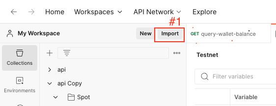
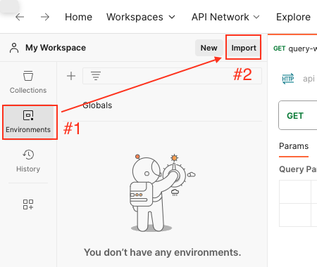
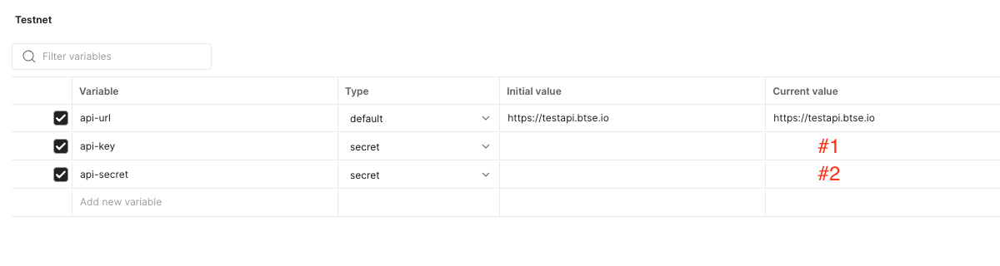

# Import Postman

## Import Collection File

1. Click on the import icon (indicated as #1 in the image below).
2. Upload the `api.postman_collection.json` file.

## Import Testnet Environment File

1. Navigate to the Environment tab (marked as #1 in the image below).
2. Click the import icon (marked as #2 in the image below).
3. Upload the `Testnet.postman_environment.json` file.

## Set API Key and API Secret in Testnet Environment

After importing, follow these steps:

1. Locate the `api-key` field (marked as #1 in the image below) and paste your Testnet API key.
2. For the `api-secret` field (also marked as #1 in the image below), paste your Testnet API secret.

Once you've completed these steps, you're ready to use the API collection to make requests to the testnet environment.
