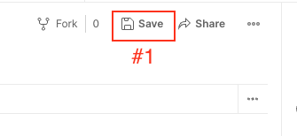
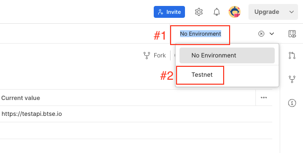
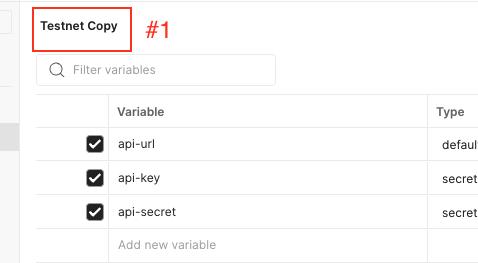
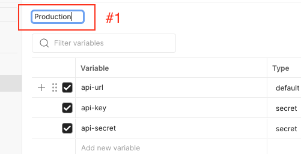
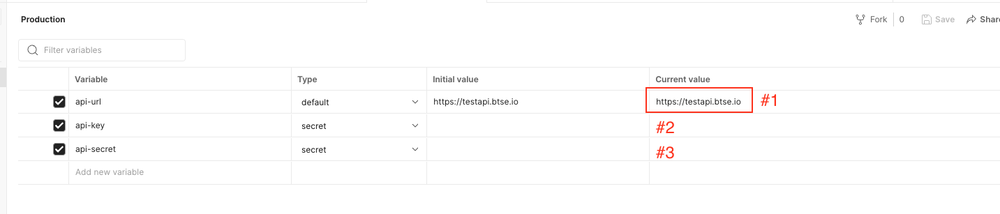
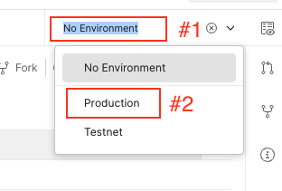

# Import Postman

## Import Collection File

1. Click on the import icon (indicated as #1 in the image below).
2. Upload the `api.postman_collection.json` file.

## Import Testnet Environment File

1. Navigate to the Environment tab (marked as #1 in the image below).
2. Click the import icon (marked as #2 in the image below).
3. Upload the `Testnet.postman_environment.json` file.

## Set API Key and API Secret in Testnet Environment

After importing, follow these steps:

1. Locate the `api-key` field (marked as #1 in the image below) and paste your Testnet API key.
2. For the `api-secret` field (marked as #2 in the image below), paste your Testnet API secret.

3. Click the `Save` button (marked as #1 in the image below) to save changes.

## Switch to Testnet Environment

1. On the top right (marked as #1 in the image below), click the environment dropdown.
2. Choose `Testnet` from the options (marked as #2 in the image below).

Once you've completed these steps, you're ready to use the API collection to make requests to the testnet environment.

## Add Production Environment

1. Navigate to the Environment.
2. Click the three dot icon (marked as #1 in the image below) then click on the `Duplicate` button (marked as #2 in the image below) to duplcate Testnet environment.

3. Click the name (marked as #1 in the image below).

4. Enter `Production` as the new environment name (marked as #1 in the image below). After typing the name, press the `Enter` key to finalize the change.

5. Replace the value of `api-url` variable (marked as #1 in the image below) with production API URL `https://api.btse.com`.
6. Locate the `api-key` field (marked as #2 in the image below) and paste your Testnet API key.
7. For the `api-secret` field (marked as #3 in the image below), paste your Testnet API secret.

## Select Production Environment

1. On the top right (marked as #1 in the image below), click the environment dropdown.
2. Choose `Production` from the options (marked as #2 in the image below).

Once you've completed these steps, you're ready to use the API collection to make requests to the production environment.

> :warning: **If you are using mobile browser**: Be very careful here!